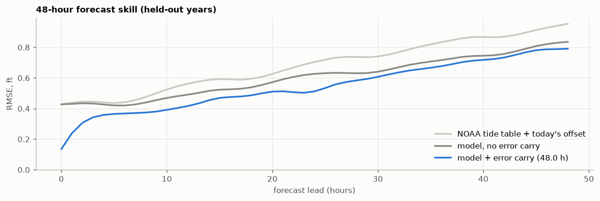
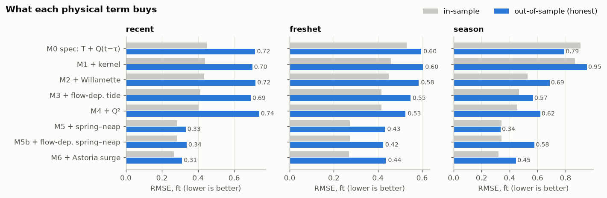
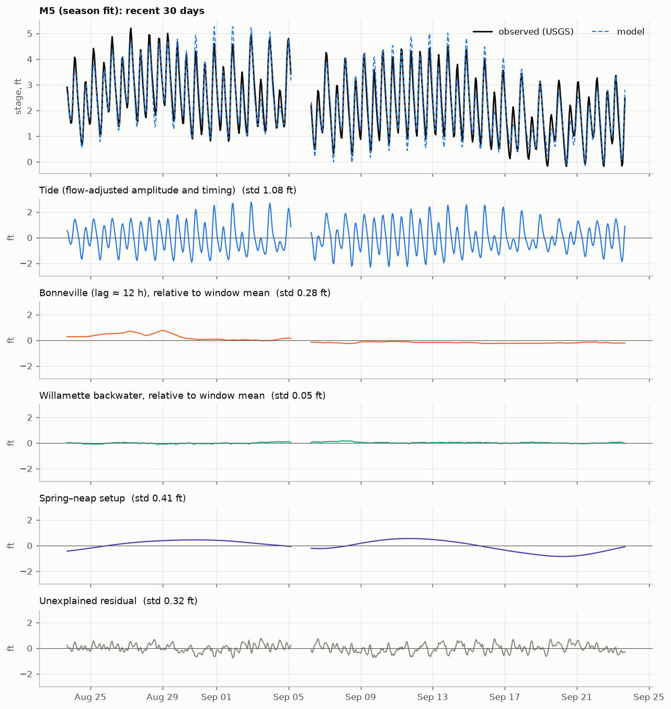
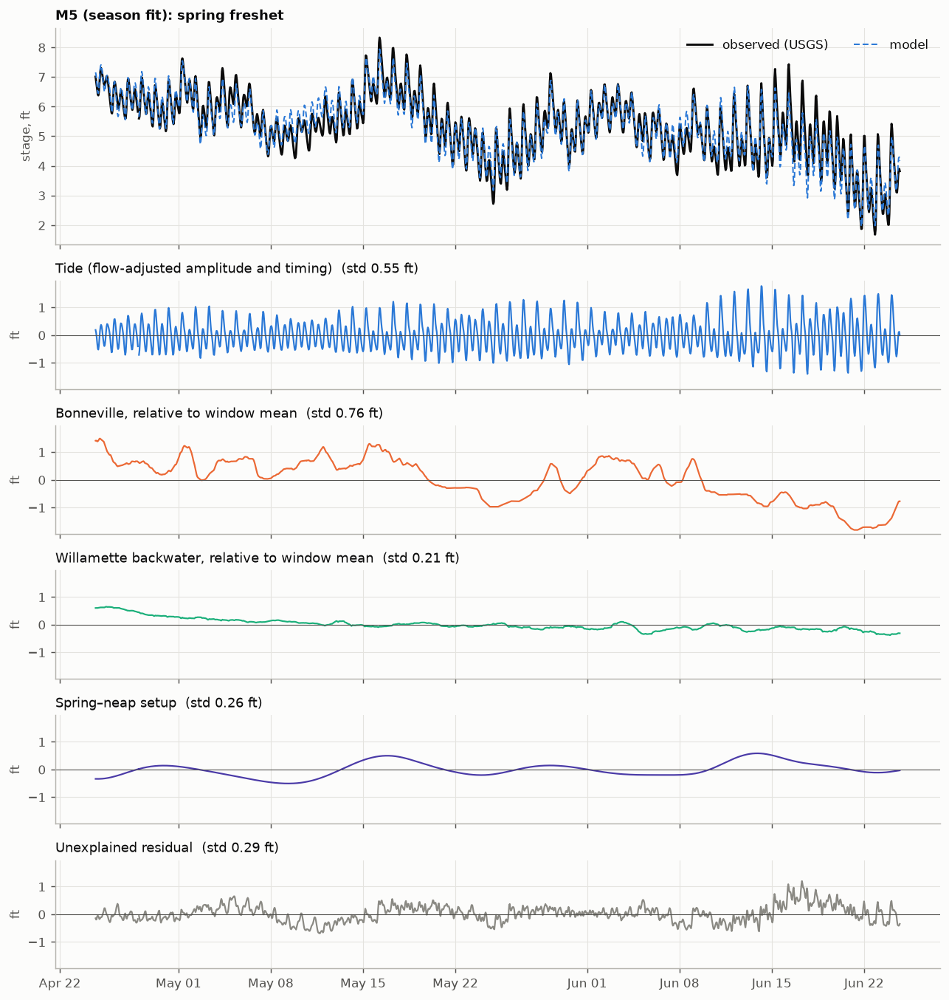
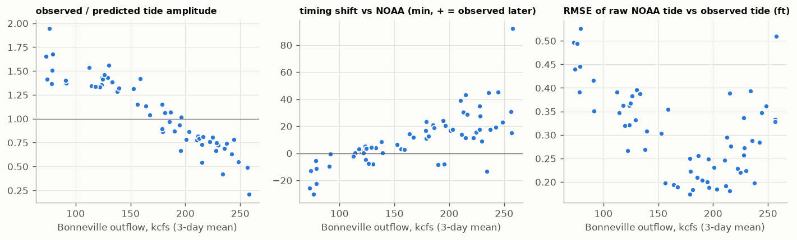

# River Brain

A gift PWA that explains why the Columbia River under a floating home on Hayden Island
(Portland, OR) is rising or falling, splitting each change into **tide**, **Bonneville
Dam release**, and **everything else**.

**Status: Phase 2 (production pipeline) complete. Next: the app UI.**
* Pipeline: the [`riverbrain/`](riverbrain) package, run hourly by GitHub Actions.
* Model: [`model/fit_report.md`](model/fit_report.md) (5-year fit, cross-validation,
  forecast skill).
* Phase 1 feasibility study:
  [`notebooks/01_feasibility.ipynb`](notebooks/01_feasibility.ipynb).
* App roadmap: [`docs/feature-plan.md`](docs/feature-plan.md).

---

## Phase 2: production pipeline

### Results of the 5-year fit (Oct 2021 – Sep 2026, 43,414 hours)

Validation is **leave one water year out**: each year is scored by a model whose
coefficients *and* lag/kernel were chosen without seeing it. The model was selected by a rule
written into the code before any results were seen.

| model | held-out RMSE (ft) | R² |
|---|---|---|
| M0 tide + Bonneville (original spec) | 1.25 | 0.73 |
| M5 Phase 1 pick (+ Willamette, flow-dependent tide, Q², spring–neap) | 0.57 | 0.94 |
| M6 + Astoria storm surge | 0.46 | 0.96 |
| **M8 + Sandy River (selected)** | **0.42** | **0.97** |
| M10 all 14 terms | 0.42 | 0.97 (within 2% of M8, so the simpler M8 wins) |

What changed since Phase 1, which only had summer data:
* **Winter needs two more drivers.** Adding **Astoria storm surge** (ocean setup from wind
  and pressure) cut error 20%. Adding the **Sandy River**, a rain-fed tributary entering
  between Bonneville and Hayden Island, cut it another 8%. Its coefficient
  (+1.0 ft per 10 kcfs) is large for its size, so it probably also stands in for other
  local rain-fed streams. The app should label it that way.
* **High flows are now in the training data.** Bonneville reached 459 kcfs, and the June
  2022 flood crest at Hayden Island hit 16.5 ft, above NWS action stage. Held-out error
  above 400 kcfs is 0.57 ft.
* **Bonneville travel time: 12.5 h centroid** (τ = 1 h, 24-h kernel), consistent with
  Phase 1.
* **Rejected again:** overtide terms, the fast Bonneville kernel, and Willamette² (each
  < 1% gain).

**Forecast skill** (48-h hindcasts every 12 h through each held-out year, using only data
available at the time):

| lead | 1 h | 6 h | 12 h | 24 h | 48 h |
|---|---|---|---|---|---|
| model RMSE (ft) | 0.24 | 0.37 | 0.42 | 0.51 | 0.79 |
| NOAA tide table + today's offset | 0.44 | 0.44 | 0.56 | 0.70 | 0.95 |



**Known weakness, and the next model improvement.** At low flow, ~20% of a 3–6 h change is
typically unexplained (median 0.26 ft). The residual averages +0.15 ft on rising tides and
~0 on falling ones. That's flood–ebb asymmetry (the tide rises faster than it falls), which
the overtide terms don't capture across all flows. The candidate to test next is overtides ×
low flow.

### How it runs

```
python -m riverbrain.fit   # offline, ~45 min with cache: fetch 5 yrs → CV → select → fit → hindcast
                           #   → model/coefficients.json + model/fit_report.md
python -m riverbrain.run   # hourly, ~1 min: fetch last 34 days (+16 d tide predictions) → QC →
                           #   apply model → site/data/{now,history_30d,model,fish,chem}.json
python -m pytest           # 17 offline tests (causality, attribution closure, strict JSON, …)
```

`now.json` contains:
* current stage and trend;
* **why it moved** over the last 3, 6 and 24 h, split by component, always including
  "unexplained";
* **what's in the pipe** from Bonneville;
* the next highs and lows;
* a 48-h forecast with a 5–95% band from hindcast errors;
* the NWS forecast shifted to the USGS datum, with flood stages;
* drivers: tide gain and timing vs NOAA, spring–neap state and next spring/neap, and
  flows;
* per-source freshness and warnings.

**Graceful degradation.**
* A failing source is recorded and the run continues.
* A flow source missing for the whole window is held at its training median; its component
  then shows no change, with a warning.
* If the whole run fails, the previous deploy stays up.

### Deploying (needs you)

1. Create a GitHub repo and push. In **Settings → Pages**, set the source to **GitHub
   Actions**.
2. Get a free **USGS API key** at api.waterdata.usgs.gov and add it as the repo secret
   `USGS_API_KEY`. Anonymous use is limited to 1,000 requests per hour per IP, GitHub
   runners share IPs, and we hit that limit twice while fitting.
3. Workflows: `hourly.yml` (at :17 each hour: run → append the forecast archive to the
   orphan `archive` branch → deploy Pages), `refit.yml` (manual: fit → tests → opens a PR
   for review), and `ci.yml` (tests on push).

`site/index.html` is a placeholder that shows the live JSON. The real UI is the next
phase.

---

# Phase 1: feasibility (Sep 2026)

## TL;DR

* **It works.** A physically motivated linear model explains the Vancouver gauge with
  **R² 0.92 and RMSE 0.34 ft out-of-sample** over Mar–Sep 2026, using only free, real-time
  public data and causal (production-runnable) features.
* **The model as originally specified (tide + lagged Bonneville + residual) is not good
  enough on its own**: out-of-sample R² 0.53–0.68 and RMSE 0.6–0.8 ft. Two additions
  matter most: making the tide's size and timing depend on river flow, and a
  **spring–neap "tidal setup"** term. The setup term alone halves the error.
* **Bonneville → Hayden Island travel time ≈ 12 h (± 3)**, arriving smeared over 12–24 h.
* **NOAA's tide predictions for Vancouver are only right at middling flow.** The real tide
  is ~1.6× NOAA's at late-summer low flow and ~0.5× in a freshet, arriving up to ~40 min
  late. The correlation of the amplitude ratio with Bonneville flow is −0.94.
* **For "why did it move in the last few hours?" the attribution is solid.** Multi-day
  attributions are less certain and should be presented with an honest "unexplained" bar.

## Data sources (all verified live, 2026-09-23; all free and keyless)

| Source | Endpoint | Notes / gotchas |
|---|---|---|
| USGS stage, 14144700 | `api.waterdata.usgs.gov/ogcapi/v1/collections/continuous/items` (`parameter_code=00065`, `f=csv`) | The API is now **v1** (`/v0/` still answers). 15-min, ≤ 10k rows/page, cursor paging. JSON values are strings, so use CSV. All 2026 data provisional. |
| USGS Willamette, 14211720 | same, `00060` | **5-minute** data that **goes negative**: the tide reverses the Willamette at Portland. A trailing 25-h mean gives net flow. |
| USGS tide-filtered Q (72137) | same | **~36 h behind real time** (centered filter). Unusable for an hourly nowcast. |
| NOAA CO-OPS tides, 9440083 | `api.tidesandcurrents.noaa.gov/api/prod/datagetter?product=predictions&interval=6` | Predictions include a seasonal "average river" signal. **Must be high-passed** (Godin filter) or river flow is double-counted. Future predictions are available, which the centered filter needs. |
| NOAA Astoria, 9439040 | same, `water_level` + `predictions` | Used for storm surge (obs − pred). |
| USACE Bonneville outflow | Dataquery 2.0: `nwd-wc.usace.army.mil/dd/common/web_service/webexec/getjson?query=["BON.Flow-Out.Ave.1Hour.1Hour.CBT-REV"]` | kcfs. **The server omits its TLS intermediate certificate**; Python needs `certs/digicert_global_g2_tls_rsa_sha256_2020_ca1.pem` appended to certifi (done in `sources.py`). Complete for Mar–Sep 2026. |
| USACE CWMS Data API | `cwms-data.usace.army.mil/cwms-data/timeseries?name=…&office=NWDP` | Same database, cfs, epoch-ms, quality codes. Identical values, but **73 missing hours** (three June runs) that Dataquery has. Use as fallback. |
| NWS NWPS, VAPW1 | `api.water.noaa.gov/nwps/v1/gauges/VAPW1/stageflow` | ~7-day hourly stage forecast (tide included); flow always −999. **Only the current forecast is served**, so skill must be measured by archiving issuances. Observed stage ≈ USGS + 0.13 ft. Flood stages: action 15, minor 16, moderate 20, major 25 ft. |
| DART adult passage | `cbr.washington.edu/dart/cs/php/rpt/adult_daily.php?outputFormat=csv&proj=BON&year=…&avg=1` | Daily counts per species plus `<Species>10Yr` columns and ladder water temperature. Emits a Feb 29 row in non-leap years (10-yr average); drop it. |

**Bonneville data QC.** Flags are missing, out-of-range (10–700 kcfs), spikes (> max(25 kcfs,
6 robust σ) from a 7-h median) and flatlines (≥ 8 h identical). Gaps ≤ 3 h are
interpolated; longer gaps stay missing. Mar–Sep 2026 was clean apart from two "suspect"
30–40 kcfs one-hour dips, which may be real (for example a turbine unit trip). A synthetic
fault-injection test confirms every fault type is caught.

**Datums.** USGS gage datum = NGVD29 + 1.82 ft. NWPS observed = USGS + 0.13 ft
(σ 0.06 ft), so NWS forecasts and flood stages are directly usable against USGS after
that offset. NOAA MLLW = USGS − 1.69 ft (σ 0.06 ft).

## Model and results

Everything is hourly, UTC, and fit by ordinary least squares. Scores are shown for three
windows. The recent 30 days is late-summer low flow (~75–140 kcfs). The spring freshet is
up to ~286 kcfs. The season is Mar 1 – Sep 23 (70–296 kcfs). "Out-of-sample" means lag and
coefficients chosen on the first ⅔ of a window, scored on the last ⅓.

| model | adds | season R² out | season RMSE out (ft) | recent RMSE out | freshet RMSE out |
|---|---|---|---|---|---|
| M0 (as specified) | tide + Bonneville(t−τ) | 0.53 | 0.79 | 0.72 | 0.60 |
| M1 | trailing-mean response kernel | 0.32 | 0.95 | 0.70 | 0.60 |
| M2 | + Willamette flow | 0.65 | 0.69 | 0.72 | 0.58 |
| M3 | + flow-dependent tide amplitude and phase | 0.76 | 0.57 | 0.69 | 0.55 |
| M4 | + Q² (curved stage response) | 0.71 | 0.62 | 0.74 | 0.53 |
| **M5 (recommended)** | **+ spring–neap tidal setup** | **0.92** | **0.34** | **0.33** | **0.43** |
| M5b | spring–neap × flow | 0.75 | 0.58 | 0.34 | 0.42 |
| M6 | + Astoria storm surge | 0.85 | 0.45 | 0.31 | 0.44 |

The spec model's own three-way scoring (tide+BON R² / with slow residual / out-of-sample)
was 0.86 / 0.93 / 0.55 on the recent window and 0.81 / 0.96 / 0.53 on the season.



**M5**, recommended:

```
stage = c + (a0 + a1·Q̄)·T + (p0 + p1·Q̄)·H[T]          flow-dependent tide size and timing
          + b1·Qk + b2·Qk²                              Bonneville, via 24-h response kernel
          + g·Q_Willamette(trailing 25 h)
          + e·SpringNeap                                Godin-filtered tidal envelope
```

Here `T` is NOAA's tidal oscillation (Godin high-pass), `H[T]` its Hilbert quadrature, `Q̄`
the trailing 24-h Bonneville mean, and `Qk` Bonneville averaged over a trailing w-hour
window starting τ hours back.

Physical readings from the season fit:
* **Bonneville:** +10 kcfs raises Hayden Island ≈ 0.16 ft at 80 kcfs, 0.22 ft at 150 kcfs
  and 0.32 ft at 250 kcfs. The response is ocean-controlled at low flow and
  friction-controlled at high flow. **Centroid lag 11.5–14.5 h** across all windows, and
  an independent band-pass cross-correlation gives 9–14 h.
* **Willamette:** +10 kcfs raises it ≈ 0.55 ft (backwater).
* **Spring–neap:** mean level rises during spring tides. It's a known estuary effect, and
  NOAA's own harmonics contain it as the MSf constituent.
* **Tide vs NOAA:** gain 1.62 at 80 kcfs, 1.18 at 150 and 0.60 at 250. Timing shift
  −9 min, +1 min and +43 min respectively.




### Where it breaks down



* **Raw NOAA tide predictions** are off by up to ~0.5 ft away from ~170 kcfs. M5 corrects
  this, but the correction is only calibrated up to ~296 kcfs. **A big freshet (400+ kcfs,
  as in 2011 or 2017) would be extrapolation.**
* **Residual error rises above 250 kcfs:** RMSE 0.41 ft and 95th percentile 0.94 ft,
  versus ≈ 0.33 ft and 0.63 ft elsewhere.
* **What's left in the residual:** 67% slow (other tributaries, ocean setup, local
  inflow), 15% daily (the 24-h kernel averages away daily dam load-following; diurnal
  tidal inequality), 11% overtides (shallow-water tidal distortion that a linear tide term
  can't make).
* **Multi-day attribution** between "spring–neap" and "unexplained" is soft (at 72 h they
  partly offset). Hour-scale attribution is robust.
* **Coefficients are correlated** (Bonneville, Willamette and season co-vary). The overall
  fit is trustworthy; individual coefficients less so. More years of data is the fix.

## What didn't work / surprises

* The **single-hour Bonneville lag** is poorly identified: the R²(τ) curve is flat, so the
  best τ wanders 8–17 h. A smeared response kernel fixes it.
* The **response kernel alone (M1) makes the season fit worse** out-of-sample. Without the
  Willamette term, slow Bonneville flow soaks up the Willamette's signal.
* **Flow-dependent spring–neap (M5b)** was rejected.
* **Astoria surge (M6)** overfits summer data. Re-test once winter storms are in the record.
* **USGS 72137 (tide-filtered discharge)** looked ideal but lags ~36 h.
* **Local environment:** Windows Application Control blocks SciPy's compiled DLLs and the
  venv's `Scripts\*.exe` launchers. SciPy was dropped and tools are run as `python -m …`.
  This won't affect GitHub Actions.

## Recommended production approach

1. **Fit offline, apply online.** Fit M5 on **2–3+ years** of hourly history (USGS stage
   continuous back to 2007; Bonneville and Willamette decades back; NOAA predictions for
   any period) to cover multiple freshets. Pin winter storm behavior and re-test M6 and
   overtide terms. Store `model/coefficients.json` with fit statistics, lag/kernel,
   training period and version. Refit monthly or seasonally via a manually triggered
   Action. Hourly runs only *apply* coefficients: cheap and deterministic.
2. **Hourly Action:**
   * Fetch ~5 days of USGS stage and Willamette 5-min, Bonneville (Dataquery →
     `combine_first` CDA → QC), NOAA predictions from −5 d to +3 d, the NWPS stageflow
     snapshot and DART (daily is enough).
   * Build features causally (trailing windows only, except tide terms, which use future
     predictions).
   * Write `now.json`: current stage, trend, component values, 3/6/24-h change
     attributions, the next ~12 h of Bonneville effect already "in the pipe", the NWS
     forecast (offset-corrected), a data-freshness block and QC flags.
3. **Degrade gracefully:** if Bonneville data is > 6 h stale, freeze its component and
   flag it; if USGS stage is missing, show the model-only nowcast and label it so.
4. **Archive** each NWPS forecast and our own nowcast to build forecast-skill records.
5. **Deploy** via the GitHub Pages artifact (no hourly commits bloating git history).
   Commit the archive once a day, which also keeps scheduled workflows from being
   auto-disabled after 60 days of repo inactivity.

## Run the notebook

```bash
python -m venv .venv
.venv/Scripts/python -m pip install -r requirements.txt   # Windows; use .venv/bin/python on macOS/Linux
cd notebooks
../.venv/Scripts/python -m jupytext --to ipynb 01_feasibility.py      # .py is the source of truth
../.venv/Scripts/python -m nbconvert --to notebook --execute --inplace 01_feasibility.ipynb
```

API responses are cached in `data/raw/` (gitignored). Set `RB_REFRESH=1` to re-download.
