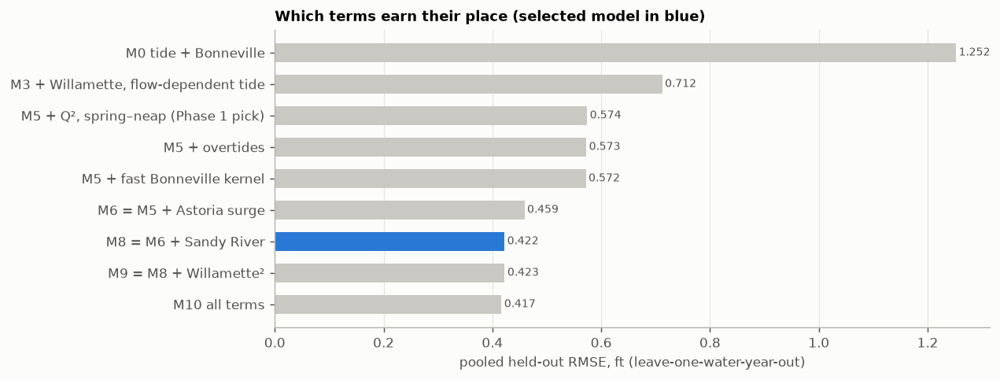
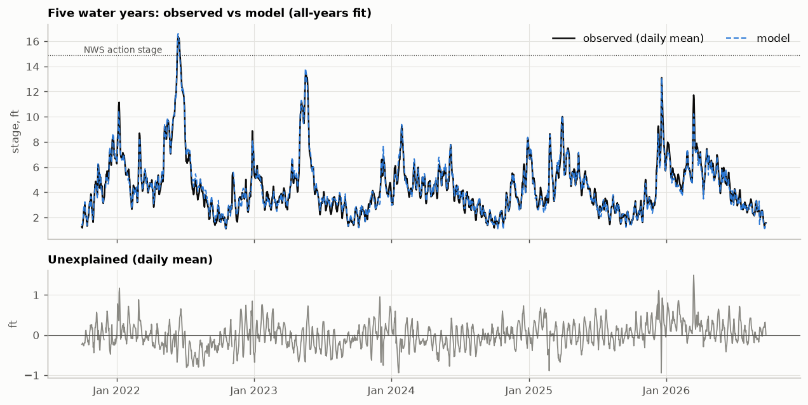

# Model fit report

*Generated by `python -m riverbrain.fit` on 2026-09-24T03:21:04+00:00. Do not edit by hand.*

**Selected model: M8 = M6 + Sandy River**. Selection rule (declared before fitting): lowest pooled cross-validated RMSE; if a model with fewer terms is within 2% of the best, prefer the one with fewest terms.

Training data: 2021-10-01 → 2026-09-24
(43,414 hours). Bonneville 70.0–459.0 kcfs,
Willamette 2.0–155.5 kcfs (25-h mean),
stage -0.59–16.49 ft.

## Cross-validation: leave one water year out

Each column is a water year scored by a model whose coefficients *and* lag/kernel were chosen
without that year. RMSE in ft.

| model | WY2022 | WY2023 | WY2024 | WY2025 | WY2026 | pooled | R² pooled |
|---|---|---|---|---|---|---|---|
| M0 tide + Bonneville | 1.363 | 1.089 | 1.383 | 1.237 | 1.161 | 1.252 | 0.734 |
| M3 + Willamette, flow-dependent tide | 0.778 | 0.709 | 0.670 | 0.692 | 0.708 | 0.712 | 0.914 |
| M5 + Q², spring–neap (Phase 1 pick) | 0.543 | 0.542 | 0.562 | 0.530 | 0.684 | 0.574 | 0.944 |
| M5 + overtides | 0.542 | 0.540 | 0.560 | 0.528 | 0.683 | 0.573 | 0.944 |
| M5 + fast Bonneville kernel | 0.539 | 0.540 | 0.560 | 0.526 | 0.682 | 0.572 | 0.945 |
| M6 = M5 + Astoria surge | 0.484 | 0.443 | 0.409 | 0.389 | 0.554 | 0.459 | 0.964 |
| M8 = M6 + Sandy River | 0.442 | 0.412 | 0.411 | 0.378 | 0.465 | 0.422 | 0.970 |
| M9 = M8 + Willamette² | 0.442 | 0.411 | 0.408 | 0.378 | 0.470 | 0.423 | 0.970 |
| M10 all terms | 0.435 | 0.407 | 0.399 | 0.370 | 0.467 | 0.417 | 0.971 |

### Selected model, held-out error by Bonneville flow

| Bonneville kcfs | hours | bias_ft | rmse_ft | p95_abs_ft |
|---|---|---|---|---|
| (0, 100] | 6184.000 | 0.033 | 0.356 | 0.689 |
| (100, 150] | 18589.000 | -0.013 | 0.406 | 0.796 |
| (150, 200] | 10281.000 | 0.032 | 0.444 | 0.906 |
| (200, 250] | 5312.000 | -0.099 | 0.454 | 0.906 |
| (250, 300] | 1605.000 | 0.059 | 0.528 | 1.028 |
| (300, 400] | 845.000 | 0.116 | 0.384 | 0.728 |
| (400, 700] | 598.000 | -0.038 | 0.573 | 1.088 |

## Coefficients

Lag τ = 1 h, kernel width w = 24 h → Bonneville centroid lag
**12.5 h**, surge lag 0 h.

| term | coefficient | meaning |
|---|---|---|
| const | -2.16130 | intercept, ft |
| T | 1.80623 | NOAA tidal oscillation (Godin high-pass of the prediction), ft |
| Tq | -0.47663 | T × trailing-24h Bonneville flow / 100 kcfs: tide amplitude varies with flow |
| HT | -0.19392 | Hilbert quadrature of T (T shifted 90°): lets the fit shift tide timing |
| HTq | 0.13104 | HT × trailing-24h Bonneville flow / 100 kcfs: tide timing varies with flow |
| q | 0.01844 | Bonneville outflow, trailing w-hour mean ending τ hours ago, kcfs |
| q2 | 0.21461 | (q / 100)²: curved stage response to flow |
| qw | 0.02822 | Willamette at Portland, trailing 25-h mean (net of tidal reversal), kcfs |
| sn | 2.33104 | spring–neap index: Godin low-pass of the tidal envelope |T + i·HT|, ft |
| surge | 0.75432 | Astoria storm surge (observed − predicted), trailing 25-h mean, ft |
| qs | 0.10361 | Sandy River (joins below Bonneville), trailing 12-h mean, kcfs |

### Physical readings

| Bonneville kcfs | ft_per_10kcfs_bonneville | tide_gain_vs_noaa | tide_timing_shift_min |
|---|---|---|---|
| 80 | 0.219 | 1.428 | -7.400 |
| 150 | 0.249 | 1.091 | 0.300 |
| 250 | 0.292 | 0.629 | 25.400 |
| 400 | 0.356 | 0.345 | 221.300 |

* Willamette: +10 kcfs → +0.28 ft at 10 kcfs, +0.28 ft at 50 kcfs, +0.28 ft at 100 kcfs
* Sandy River: +10 kcfs → +1.04 ft
* Spring–neap: +0.1 ft of predicted tidal envelope → +0.23 ft of mean level
* Astoria surge: +1 ft → +0.75 ft

## Forecast skill (hindcast)

48-h forecasts issued every 12 h through each held-out year, using only data available at
the forecast origin. Future Bonneville and Willamette flows are held at their last value; the
tide comes from predictions. The model's current error is carried forward using the option
that minimized mean RMSE across leads: **resid_tau_48.0** (mean RMSE by option:
baseline_noaa_plus_offset 0.682, resid_tau_12.0 0.564, resid_tau_24.0 0.549, resid_tau_3.0 0.588, resid_tau_48.0 0.542, resid_tau_6.0 0.578, resid_tau_None 0.606, resid_tau_inf 0.560).

| lead (h) | model RMSE | model 5–95% error | tide-table RMSE |
|---|---|---|---|
| 1 | 0.238 | -0.39 to +0.39 | 0.438 |
| 3 | 0.342 | -0.56 to +0.55 | 0.444 |
| 6 | 0.367 | -0.63 to +0.53 | 0.440 |
| 12 | 0.416 | -0.71 to +0.59 | 0.562 |
| 24 | 0.512 | -0.76 to +0.76 | 0.704 |
| 36 | 0.676 | -1.04 to +0.99 | 0.833 |
| 48 | 0.790 | -1.18 to +1.22 | 0.953 |

The comparison baseline is NOAA's raw prediction plus the observed offset over the previous 24 h.

## Diagnostics

* Tide terms computed on the live run's ~50-day window vs the full record, max abs difference at
  "now" over 20 random times: {'T': 0.0, 'HT': 0.0019, 'sn': 0.0001} (ft).
* Bonneville QC flags over the training period: {'missing': 3, 'range': 0, 'spike': 19, 'flat': 0, 'filled': 22, 'still_missing': 0}.
* Dataquery vs CDA max difference where both have data: 0.0 kcfs.
